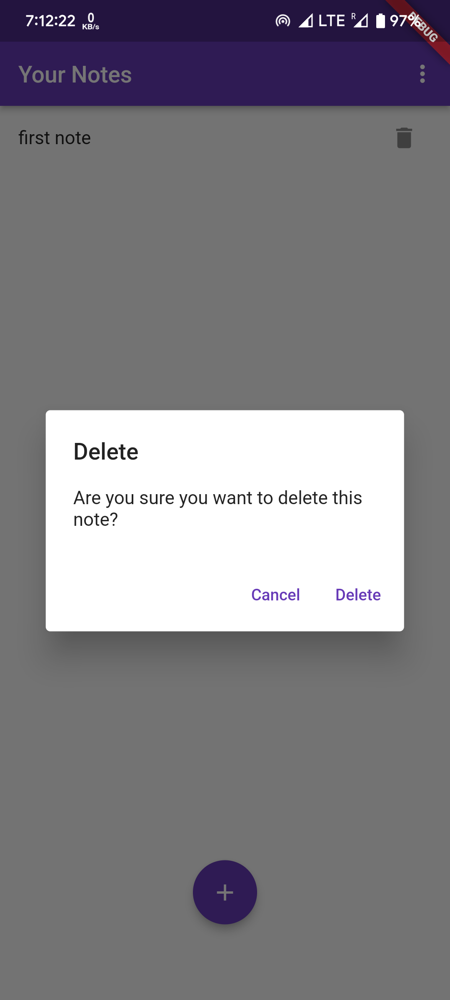

# NoNotes

## Note taking application made in Flutter with Firebase backend.  

***
# APK: 
[NoNotes](https://github.com/ShlokBharadwaj/no-notes/releases/tag/v1.0.0).

# Screenshots:  
<table style={border: "none"}>
<tr>
<td></td>
<td></td>
<td></td>
</tr>

<tr>
<td></td>
<td></td>
<td></td>
</tr>

<tr>
<td></td>
<td></td>
<td></td>
</tr>

</table>
